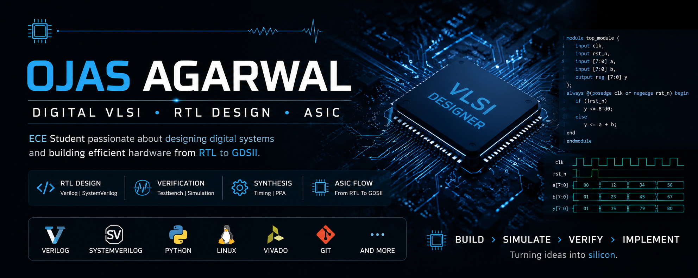

<div align="center">



</div>

# 👋 Hi, I'm Ojas Agarwal

### `ECE Student` • `Digital VLSI` • `RTL Design` • `ASIC`

**Exploring how digital logic becomes real hardware.**

</div>

---

## 🧠 About Me

I'm an **Electronics & Communication Engineering student** building my foundation in **Digital VLSI, RTL Design and ASIC Design**.

I'm currently focused on understanding digital systems from the fundamentals — from **logic design and Verilog RTL** to **simulation, synthesis and hardware implementation**.

My goal is to gradually move from writing individual RTL modules to understanding the **complete digital ASIC design flow**.

---

## 🔭 What I'm Currently Learning

* 🔹 Digital Logic & Computer Architecture
* 🔹 Verilog HDL
* 🔹 RTL Design & Testbenches
* 🔹 SystemVerilog
* 🔹 FPGA Design
* 🔹 ASIC Design Flow
* 🔹 Linux & Git
* 🔹 Python / Tcl for automation

---

## 🛠️ Technical Interests

| Area                    | Technologies                                   |
| ----------------------- | ---------------------------------------------- |
| 💻 Hardware Description | `Verilog` `SystemVerilog`                      |
| 🔧 Digital Design       | `Combinational Logic` `Sequential Logic` `FSM` |
| ⚡ RTL                   | `RTL Design` `Testbenches` `Simulation`        |
| 🏗️ VLSI                | `ASIC` `FPGA` `RTL-to-GDSII`                   |
| 🐧 Software             | `Linux` `Git` `Python` `Tcl`                   |
| 🧪 EDA                  | `Vivado` and other tools as I learn them       |

---

## 🚀 Featured Projects

> This section will grow as I build and document real VLSI projects.

### 🔧 Digital Logic & RTL

**Coming Soon**

Building fundamental RTL modules and documenting their:

`RTL → Testbench → Simulation → Results`

### ⚡ FPGA Projects

**Coming Soon**

Exploring how RTL designs can be implemented and tested on FPGA hardware.

### 🏗️ ASIC Design

**Learning in Progress**

Working toward understanding the complete flow:

`RTL → Verification → Synthesis → Timing → Physical Design → GDSII`

---

## 📈 My Learning Journey

```text
Digital Logic
      ↓
   Verilog
      ↓
  RTL Design
      ↓
Simulation & Verification
      ↓
   Synthesis
      ↓
Timing & PPA Analysis
      ↓
Physical Design
      ↓
    GDSII
```

---

## 🎯 Current Focus

> **Build → Simulate → Understand → Document → Improve**

I'm focusing on building projects rather than simply collecting technologies.

My priority is to understand **why a circuit works**, how its RTL behaves in simulation, and eventually how that RTL moves through the ASIC design flow.

---

## 📚 VLSI Roadmap

* [x] Digital Logic Fundamentals
* [ ] Verilog HDL
* [ ] RTL Design
* [ ] SystemVerilog
* [ ] Verification
* [ ] Synthesis
* [ ] Static Timing Analysis
* [ ] Physical Design
* [ ] Complete RTL-to-GDSII Flow

---

## 📊 GitHub Activity

I'm using this profile to document my progress, projects, experiments and learning in **Digital VLSI & ASIC Design**.

---

## 🤝 Let's Connect

I'm always interested in learning from people working in:

**Digital Design • VLSI • ASIC • FPGA • Semiconductor Engineering**

---

<div align="center">

### ⚡ Building my VLSI journey, one RTL block at a time.

⭐ **Thanks for visiting my profile!**

</div>
